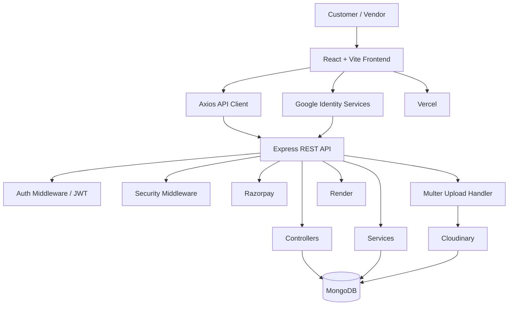
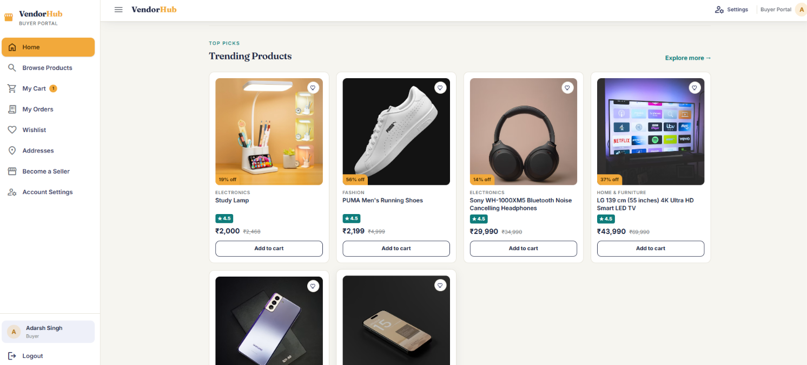
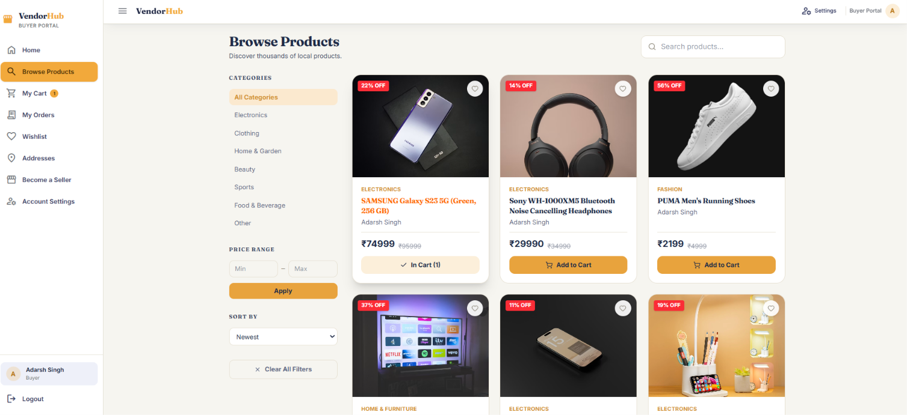
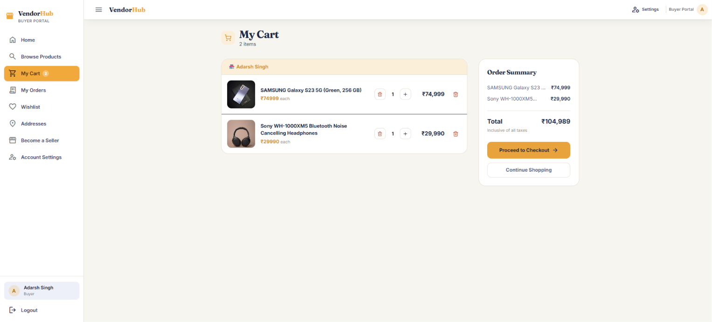

<div align="center">

# 🛍️ VendorHub

### Hyperlocal Multi-Vendor E-Commerce Platform

A modern full-stack marketplace designed to connect customers with local vendors through a secure, scalable, and user-friendly shopping experience.

<p>
  <a href="https://vendorhub-sigma.vercel.app/">
    
  </a>
  <a href="https://github.com/adarshsingh31">
    
  </a>
  <a href="https://www.linkedin.com/in/adarsh-singh-936380341/">
    
  </a>
</p>

<p>
  
  
  
  
  
  
  
  
</p>

</div>

---

## ✨ Overview

**VendorHub** is a full-stack hyperlocal multi-vendor e-commerce platform built to bring customers and local vendors together in one digital marketplace.

The project uses a separate React/Vite frontend and Node.js/Express backend, with MongoDB/Mongoose for data persistence. It integrates **Google OAuth authentication**, **Cloudinary-based cloud media storage**, Razorpay payment processing, and a layered backend security architecture, all deployed to production.

The architecture is designed around a clean separation of concerns:

```text
Customer / Vendor
       │
       ▼
React + Vite Frontend
       │
       │ REST API
       ▼
Node.js + Express Backend
       │
 ┌─────┼───────────┬────────────┐
 ▼     ▼            ▼            ▼
MongoDB  Google OAuth  Cloudinary  Razorpay
```

---

## 🚀 Live Demo

### 🌐 Application

**https://vendorhub-sigma.vercel.app/**

### ⚙️ Backend API

**https://vendorhub-server-v7v5.onrender.com/**

### ❤️ API Health Check

```http
GET /api/health
```

Expected response:

```json
{
  "status": "OK",
  "message": "VendorHub API is running securely."
}
```

---

## 🎯 What VendorHub Solves

Traditional local shopping can require customers to visit multiple stores, compare products manually, and use separate channels to communicate with sellers.

VendorHub aims to provide a centralized digital marketplace where:

- Customers can discover products from vendors.
- Vendors can manage their marketplace presence, including product images.
- Users can authenticate securely, including one-click sign-in via Google.
- Orders and payments can be handled through the platform.
- Product and profile images are stored reliably on the cloud rather than the server's local disk.
- The frontend communicates with a dedicated REST API.
- Sensitive operations and credentials remain on the backend.

---

## 🔥 Core Features

### 👤 Authentication

- Email/password-based user authentication
- **Google OAuth 2.0 sign-in** for one-click login/signup
- JWT-based session/auth token issuance
- Protected API routes guarded by authentication middleware
- Environment-based OAuth client credential configuration

### 🛒 E-Commerce

- Product-based marketplace experience
- Shopping/cart workflow
- Order-related backend APIs
- Vendor-oriented marketplace architecture
- Responsive React user interface

### 💳 Payments

- Razorpay payment integration
- Server-side payment order creation
- Frontend-to-backend payment workflow
- Payment-related API endpoints
- Secret payment credentials kept on the server

### ☁️ Media & File Storage (Cloudinary)

- **Cloudinary** used as the cloud storage provider for images (e.g. product/vendor/profile images)
- Uploaded files are processed via `Multer` and forwarded to Cloudinary rather than persisted permanently on local disk
- Cloudinary-hosted URLs are stored in MongoDB documents and served directly to the frontend
- Keeps the backend stateless with respect to media storage, which is important for platforms like Render where local disk storage isn't persistent across deploys

### 🏪 Multi-Vendor Architecture

VendorHub is structured around a multi-vendor marketplace model, allowing the application to evolve around customers, vendors, products, orders, and platform-level operations.

### 🔐 Security

The backend includes multiple production-oriented security layers, including:

- Helmet
- CORS configuration
- Rate limiting
- MongoDB sanitization
- XSS protection
- HTTP Parameter Pollution protection
- Request compression
- Request logging
- JWT authentication middleware

---

## 🧰 Tech Stack

### Frontend

| Technology               | Purpose                            |
| ------------------------ | ---------------------------------- |
| React                    | User interface                     |
| Vite                     | Development/build tooling          |
| Axios                    | HTTP/API communication             |
| React Context            | Application state/context          |
| Google Identity Services | Google OAuth sign-in on the client |
| CSS                      | Styling                            |

### Backend

| Technology       | Purpose                            |
| ---------------- | ---------------------------------- |
| Node.js          | JavaScript runtime                 |
| Express.js       | REST API framework                 |
| MongoDB          | Database                           |
| Mongoose         | MongoDB ODM                        |
| JWT              | Authentication tokens              |
| Google OAuth 2.0 | Third-party authentication         |
| Multer           | Multipart form-data / file parsing |
| Cloudinary       | Cloud image storage & delivery     |
| Razorpay         | Payment processing                 |

### Security & Backend Middleware

| Package                | Purpose                             |
| ---------------------- | ----------------------------------- |
| Helmet                 | Secure HTTP headers                 |
| CORS                   | Cross-origin access control         |
| express-rate-limit     | Rate limiting                       |
| express-mongo-sanitize | MongoDB injection protection        |
| xss-clean              | XSS protection                      |
| HPP                    | HTTP parameter pollution protection |
| Compression            | Response compression                |
| Morgan                 | HTTP request logging                |

### Deployment

| Service    | Usage                   |
| ---------- | ----------------------- |
| Vercel     | React frontend          |
| Render     | Node.js/Express backend |
| MongoDB    | Persistent database     |
| Cloudinary | Media/image hosting     |

---

## 🏗️ Architecture



### Request Flow

```text
Browser
   │
   ▼
Vercel
   │
   ▼
React / Vite
   │
   │ Axios
   ▼
Render
   │
   ▼
Express API
   │
   ├── Middleware (Auth / Security)
   ├── Routes
   ├── Controllers
   ├── Services
   │      ├── Google OAuth verification
   │      └── Cloudinary upload
   └── Models
          │
          ▼
       MongoDB
```

---

## 📂 Project Structure

```text
VendorHub/
│
├── client/
│   ├── public/
│   ├── src/
│   │   ├── components/
│   │   ├── context/
│   │   ├── data/
│   │   ├── pages/
│   │   ├── services/
│   │   ├── App.jsx
│   │   ├── index.css
│   │   └── main.jsx
│   │
│   ├── .env
│   ├── index.html
│   ├── package.json
│   └── vercel.json
│
├── server/
│   ├── src/
│   │   ├── config/          # DB, Cloudinary, and app configuration
│   │   ├── controllers/
│   │   ├── middleware/      # Auth, security, upload middleware
│   │   ├── models/
│   │   ├── routes/
│   │   ├── services/        # Google OAuth verification, Cloudinary upload logic
│   │   ├── uploads/         # Temp storage before Cloudinary upload (if used)
│   │   ├── utils/
│   │   ├── app.js
│   │   └── server.js
│   │
│   ├── .env
│   ├── .gitignore
│   ├── package.json
│   └── README.md
│
└── README.md
```

### Frontend Responsibilities

- `components/` — Reusable UI components
- `context/` — Shared application state/context
- `data/` — Application/static data
- `pages/` — Page-level UI
- `services/` — API/service communication (Axios instance, Google auth calls)
- `App.jsx` — Main React application
- `main.jsx` — React entry point

### Backend Responsibilities

- `config/` — Database and Cloudinary configuration
- `controllers/` — Request handling
- `middleware/` — Authentication, security, and upload middleware
- `models/` — Mongoose database models
- `routes/` — REST API route definitions
- `services/` — Business logic, Google token verification, Cloudinary upload service
- `uploads/` — Local/temporary file staging (files are ultimately persisted on Cloudinary)
- `utils/` — Utility functions
- `app.js` — Express application configuration
- `server.js` — Server entry point

---

## ⚙️ Getting Started

### Prerequisites

Make sure you have installed/configured:

- Node.js 18+
- npm
- MongoDB or a MongoDB Atlas database
- Git
- A **Cloudinary** account (cloud name, API key, API secret)
- A **Google Cloud OAuth 2.0 Client ID** (for Google Sign-In)
- A Razorpay account for payment functionality

---

## 📥 Installation

Clone the project repository and enter the project directory:

```bash
git clone <YOUR_VENDORHUB_REPOSITORY_URL>
cd VendorHub
```

### Install Frontend Dependencies

```bash
cd client
npm install
```

### Install Backend Dependencies

Open another terminal:

```bash
cd server
npm install
```

---

## 🔑 Environment Variables

### Frontend

Create:

```text
client/.env
```

Example structure:

```env
VITE_API_URL=http://localhost:5000
VITE_GOOGLE_CLIENT_ID=your_google_oauth_client_id
```

| Variable                | Purpose                                                                   |
| ----------------------- | ------------------------------------------------------------------------- |
| `VITE_API_URL`          | Base URL the frontend uses to call the backend API                        |
| `VITE_GOOGLE_CLIENT_ID` | Google OAuth Client ID used to render/handle Google Sign-In on the client |

### Backend

Create:

```text
server/.env
```

Example structure:

```env
PORT=5000
MONGODB_URI=your_mongodb_connection_string
JWT_SECRET=your_jwt_secret

# Google OAuth
GOOGLE_CLIENT_ID=your_google_oauth_client_id
GOOGLE_CLIENT_SECRET=your_google_oauth_client_secret

# Cloudinary
CLOUDINARY_CLOUD_NAME=your_cloudinary_cloud_name
CLOUDINARY_API_KEY=your_cloudinary_api_key
CLOUDINARY_API_SECRET=your_cloudinary_api_secret

# Razorpay
RAZORPAY_KEY_ID=your_razorpay_key_id
RAZORPAY_KEY_SECRET=your_razorpay_key_secret
```

| Variable                | Purpose                                                            |
| ----------------------- | ------------------------------------------------------------------ |
| `PORT`                  | Port the Express server listens on                                 |
| `MONGODB_URI`           | MongoDB connection string                                          |
| `JWT_SECRET`            | Secret used to sign/verify JWT auth tokens                         |
| `GOOGLE_CLIENT_ID`      | Google OAuth Client ID used to verify Google sign-in on the server |
| `GOOGLE_CLIENT_SECRET`  | Google OAuth Client Secret (server-side only)                      |
| `CLOUDINARY_CLOUD_NAME` | Cloudinary account cloud name                                      |
| `CLOUDINARY_API_KEY`    | Cloudinary API key used to authenticate uploads                    |
| `CLOUDINARY_API_SECRET` | Cloudinary API secret (server-side only)                           |
| `RAZORPAY_KEY_ID`       | Razorpay public key ID                                             |
| `RAZORPAY_KEY_SECRET`   | Razorpay secret key (server-side only)                             |

> ⚠️ Never commit `.env` files, API keys, database credentials, OAuth secrets, or Cloudinary/payment secrets to GitHub.

---

## ▶️ Running Locally

### Start Backend

```bash
cd server
npm run dev
```

The backend should run on your configured local port, commonly:

```text
http://localhost:5000
```

### Start Frontend

In another terminal:

```bash
cd client
npm run dev
```

Vite will provide the local development URL, commonly:

```text
http://localhost:5173
```

---

## 🔌 API

VendorHub follows a modular REST API architecture.

The backend separates API functionality into:

```text
Routes
   ↓
Controllers
   ↓
Services
   ↓
Models
   ↓
MongoDB
```

Example health endpoint:

```http
GET /api/health
```

Response:

```json
{
  "status": "OK",
  "message": "VendorHub API is running securely."
}
```

### Authentication API

```http
POST /api/auth/google
```

Verifies a Google ID token received from the client and issues a session/JWT token for the authenticated user.

### Upload / Media API

Image uploads submitted via `Multer` are processed and forwarded to Cloudinary; the resulting secure Cloudinary URL is stored against the relevant document (e.g. product or user profile) in MongoDB.

### Payment API

```http
POST /api/payment/create-order
```

Creates a payment order through the configured Razorpay integration.

> For the complete API reference, see the route files inside `server/src/routes/`.

---

## 🔐 Authentication Flow

VendorHub supports both standard credential-based authentication and **Google OAuth**:

```text
Client (Google Identity Services)
        │
        │ Google ID Token
        ▼
   React Frontend
        │
        │ POST /api/auth/google
        ▼
   Express Backend
        │
        ├── Verify ID token with Google
        ├── Find or create user in MongoDB
        └── Issue backend JWT
        │
        ▼
   Frontend stores JWT
        │
        ▼
Subsequent requests → Authorization header → Auth Middleware → Protected Routes
```

- Google sign-in removes the need for the user to manage a separate password for VendorHub.
- The backend independently verifies the Google ID token rather than trusting the client — the Google Client Secret and verification logic stay server-side.
- Once authenticated, VendorHub issues its own JWT so subsequent API calls are authenticated the same way regardless of login method.

---

## ☁️ Cloud Media Storage (Cloudinary)

VendorHub uses **Cloudinary** for storing and serving images (e.g. product images, vendor/profile assets) instead of relying on the server's local filesystem.

```text
Client (Image Upload Form)
        │
        │ multipart/form-data
        ▼
   Multer (parses upload)
        │
        ▼
   Cloudinary Upload Service
        │
        │ returns secure_url
        ▼
   MongoDB (URL stored on document)
        │
        ▼
   Frontend renders image via Cloudinary URL
```

**Why Cloudinary:**

- Backend hosting platforms like Render use ephemeral filesystems — files saved locally can be lost on redeploy/restart. Cloudinary keeps media persistent and independent of the server lifecycle.
- Cloudinary serves images via a CDN, improving load times for the frontend.
- Upload credentials (`CLOUDINARY_API_KEY` / `CLOUDINARY_API_SECRET`) are kept strictly on the backend; the frontend never uploads directly with secret credentials.

---

## 💳 Payment Flow

The payment architecture follows a client → server → payment-provider flow:

```text
Customer
   │
   ▼
React Checkout
   │
   │ POST request
   ▼
Express Backend
   │
   ▼
Razorpay Order Creation
   │
   ▼
Payment Response
   │
   ▼
Frontend Payment Flow
```

Sensitive Razorpay credentials are kept on the backend and should never be exposed through frontend environment variables.

---

## 🔐 Security Architecture

VendorHub's backend includes multiple security layers:

```text
Incoming Request
       │
       ▼
      CORS
       │
       ▼
     Helmet
       │
       ▼
   Rate Limiting
       │
       ▼
MongoDB Sanitization
       │
       ▼
   XSS Protection
       │
       ▼
      HPP
       │
       ▼
Authentication / Authorization (JWT + Google verification)
       │
       ▼
     Routes
```

This layered approach helps reduce common web application risks while keeping security concerns centralized in backend middleware.

---

## ☁️ Deployment

### Frontend

Deployed using **Vercel**:

https://vendorhub-sigma.vercel.app/

### Backend

Deployed using **Render**:

https://vendorhub-server-v7v5.onrender.com/

### Production Configuration

For production deployment:

1. Configure frontend environment variables in Vercel (`VITE_API_URL`, `VITE_GOOGLE_CLIENT_ID`).
2. Configure backend environment variables in Render (MongoDB, JWT, Google OAuth, Cloudinary, Razorpay).
3. Set the frontend API URL to the deployed Render backend.
4. Configure CORS to allow the deployed frontend origin.
5. Configure MongoDB production credentials.
6. Configure Google OAuth authorized origins/redirect URIs for the production domain.
7. Configure Cloudinary production credentials for image uploads.
8. Configure Razorpay credentials securely.

---

## 🖼️ Screenshots

| Home                        | Browse Products                     |
| --------------------------- | ----------------------------------- |
|  |  |

### Cart



---

## 🧪 Development & Testing

Before pushing changes to production, verify:

```text
✓ Frontend builds successfully
✓ Backend starts successfully
✓ MongoDB connection works
✓ Email/password authentication works
✓ Google OAuth sign-in works end-to-end
✓ Image uploads reach Cloudinary successfully
✓ API requests reach the production backend
✓ CORS configuration is correct
✓ Payment order creation works
✓ Protected routes reject unauthorized requests
✓ Environment variables are configured
✓ No secrets are committed
```

---

## 🛣️ Roadmap

Potential future improvements include:

- [ ] Advanced vendor analytics
- [ ] Real-time order tracking
- [ ] Real-time notifications
- [ ] Product recommendation system
- [ ] Advanced product search and filtering
- [ ] Vendor performance analytics
- [ ] Automated email/SMS notifications
- [ ] Improved admin analytics
- [ ] Automated testing and CI/CD
- [ ] Additional OAuth providers (e.g. Facebook, GitHub)

---

## 💡 Engineering Highlights

VendorHub demonstrates practical full-stack development concepts including:

- Component-based React architecture
- RESTful API design
- Node.js and Express backend development
- MongoDB database integration
- Mongoose data modeling
- JWT-based authentication and protected routes
- Third-party OAuth integration (Google)
- Cloud media storage integration (Cloudinary)
- Payment gateway integration (Razorpay)
- Secure environment configuration
- API security middleware
- File upload handling
- Frontend/backend separation
- Production deployment across Vercel and Render
- CORS configuration
- Error handling and API health monitoring

---

## 🤝 Contributing

Contributions are welcome.

### 1. Fork the repository

```bash
git fork <repository-url>
```

### 2. Create a feature branch

```bash
git checkout -b feature/your-feature
```

### 3. Make your changes

```bash
git add .
git commit -m "feat: add your feature"
```

### 4. Push your branch

```bash
git push origin feature/your-feature
```

### 5. Open a Pull Request

Describe your changes clearly and include screenshots when modifying the UI.

---

## 👨‍💻 Developer

<div align="center">

### Adarsh Singh

**Computer Science & Engineering Student**

**NIT Raipur**

<p>
  <a href="https://github.com/adarshsingh31">
    
  </a>
  <a href="https://www.linkedin.com/in/adarsh-singh-936380341/">
    
  </a>
</p>

</div>

---

## 📄 License

This project is licensed under the [MIT License](./LICENSE).

Copyright © 2026 Adarsh Singh.

---

<div align="center">

### ⭐ If you find VendorHub useful, consider giving the repository a star!

**Built with React, Node.js, Express, MongoDB, Google OAuth & Cloudinary ❤️**

</div>
